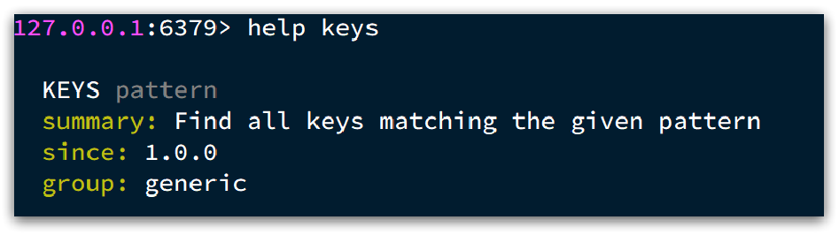
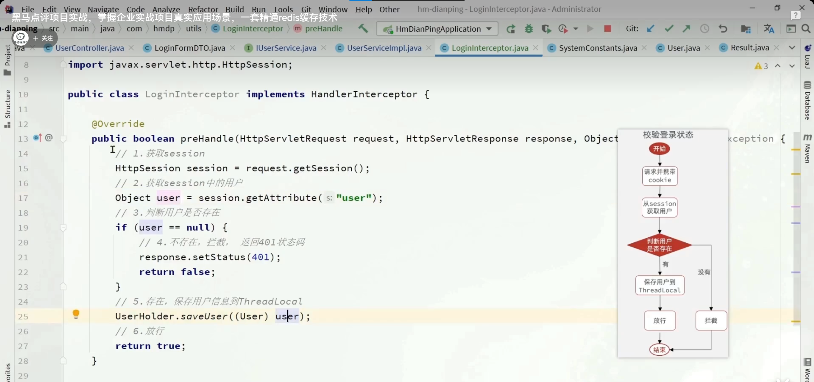
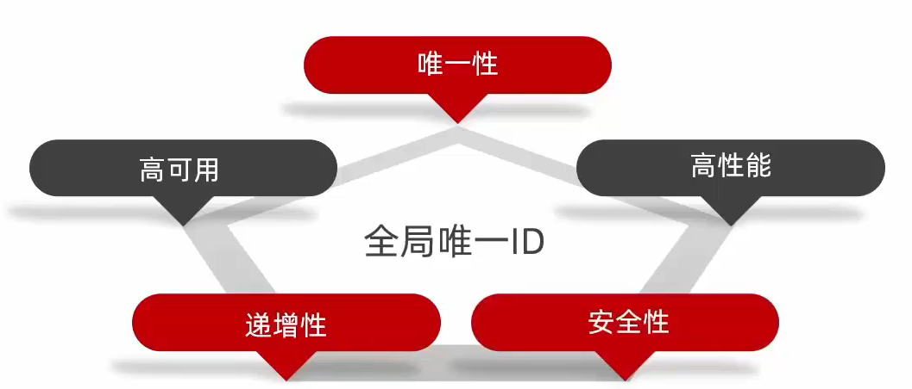

# 基础篇Redis

## 1.Redis简单介绍

Redis是一种键值型的NoSql数据库，这里有两个关键字：

- 键值型
- NoSql

其中**键值型**，是指Redis中存储的数据都是以key.value对的形式存储，而value的形式多种多样，可以是字符串.数值.甚至json：

而NoSql则是相对于传统关系型数据库而言，有很大差异的一种数据库。

对于存储的数据，没有类似Mysql那么严格的约束，比如唯一性，是否可以为null等等，所以我们把这种松散结构的数据库，称之为NoSQL数据库。


## 2.课程目录

>- 初始Redis
>    - 认识NoSQL
>    - 认识Redis
>    - 安装Redis
>- Redis常见命令
>    - 5种常见数据结构
>    - 通用命令
>    - 不同数据结构的操作命令
>- Redis的Java客户端
>    - Jedis客户端
>    - SpringDataRedis客户端


## 3.初始Redis

### 3.1.认识NoSQL

**NoSql**可以翻译做Not Only Sql（不仅仅是SQL），或者是No Sql（非Sql的）数据库。是相对于传统关系型数据库而言，有很大差异的一种特殊的数据库，因此也称之为**非关系型数据库**。

#### 3.1.1.结构化与非结构化

传统关系型数据库是结构化数据，每一张表都有严格的约束信息：字段名.字段数据类型.字段约束等等信息，插入的数据必须遵守这些约束（unsigned是只能存储非负整数）：


而NoSql则对数据库格式没有严格约束，往往形式松散，自由。

可以是键值型：


也可以是文档型：


甚至可以是图格式：


#### 3.1.2.关联和非关联

传统数据库的表与表之间往往存在关联，例如外键：


而非关系型数据库不存在关联关系，要维护关系要么靠代码中的业务逻辑，要么靠数据之间的耦合：

```json
{
  id: 1,
  name: "张三",
  orders: [
    {
       id: 1,
       item: {
	 id: 10, title: "荣耀6", price: 4999
       }
    },
    {
       id: 2,
       item: {
	 id: 20, title: "小米11", price: 3999
       }
    }
  ]
}
```

此处要维护“张三”的订单与商品“荣耀”和“小米11”的关系，不得不冗余的将这两个商品保存在张三的订单文档中，不够优雅。还是建议用业务来维护关联关系。


#### 3.1.3.查询方式

传统关系型数据库会基于Sql语句做查询，语法有统一标准；

而不同的非关系数据库查询语法差异极大，五花八门各种各样。


#### 3.1.4.事务

传统关系型数据库能满足事务ACID的原则。（原子性，一致性，隔离性，持久性）


而非关系型数据库往往不支持事务，或者不能严格保证ACID的特性，只能实现基本的一致性。


#### 3.1.5.总结

除了上述四点以外，在存储方式.扩展性.查询性能上关系型与非关系型也都有着显著差异，总结如下：


- 存储方式
  - 关系型数据库基于磁盘进行存储，会有大量的磁盘IO，对性能有一定影响
  - 非关系型数据库，他们的操作更多的是依赖于内存来操作，内存的读写速度会非常快，性能自然会好一些

* 扩展性
  * 关系型数据库集群模式一般是主从，主从数据一致，起到数据备份的作用，称为垂直扩展。
  * 非关系型数据库可以将数据拆分，存储在不同机器上，可以保存海量数据，解决内存大小有限的问题。称为水平扩展。
  * 关系型数据库因为表之间存在关联关系，如果做水平扩展会给数据查询带来很多麻烦


### 3.2.认识Redis

Redis诞生于2009年全称是**Re**mote  **D**ictionary **S**erver 远程词典服务器，是一个基于内存的键值型NoSQL数据库。

**特征**：

- 键值（key-value）型，value支持多种不同数据结构，功能丰富
- 单线程，每个命令具备原子性（网络IO和键值对读写是由一个线程来完成的；IO多路复用技术）
- 低延迟，速度快（基于内存.IO多路复用.良好的编码）。
- 支持数据持久化
- 支持主从集群.分片集群
- 支持多语言客户端

**作者**：Antirez

Redis的官方网站地址：https://redis.io/

### 3.3.安装Redis

大多数企业都是基于Linux服务器来部署项目，而且Redis官方也没有提供Windows版本的安装包。因此课程中我们会基于Linux系统来安装Redis.

此处选择的Linux版本为CentOS 7.

#### 3.3.1.依赖库

Redis是基于C语言编写的，因此首先需要安装Redis所需要的gcc依赖：

```sh
yum install -y gcc tcl
```


#### 3.3.2.上传安装包并解压

然后将课前资料提供的Redis安装包上传到虚拟机的任意目录：


例如，我放到了/usr/local/src 目录：


解压缩：

```sh
tar -xzf redis-6.2.6.tar.gz
```

解压后：


进入redis目录：

```sh
cd redis-6.2.6
```


运行编译命令：

```sh
make && make install
```

如果没有出错，应该就安装成功了。


默认的安装路径是在 `/usr/local/bin`目录下：


该目录已经默认配置到环境变量，因此可以在任意目录下运行这些命令。其中：

- redis-cli：是redis提供的命令行客户端
- redis-server：是redis的服务端启动脚本
- redis-sentinel：是redis的哨兵启动脚本


#### 3.3.3.启动

redis的启动方式有很多种，例如：

- 默认启动
- 指定配置启动
- 开机自启


#### 3.3.4.默认启动

安装完成后，在任意目录输入redis-server命令即可启动Redis：

```
redis-server
```

如图：


这种启动属于`前台启动`，会阻塞整个会话窗口，窗口关闭或者按下`CTRL + C`则Redis停止。不推荐使用。

#### 3.3.5.指定配置启动

如果要让Redis以`后台`方式启动，则必须修改Redis配置文件，就在我们之前解压的redis安装包下（`/usr/local/src/redis-6.2.6`），名字叫redis.conf：


我们先将这个配置文件备份一份：

```
cp redis.conf redis.conf.bck
```


然后修改redis.conf文件中的一些配置：

```properties
# 允许访问的地址，默认是127.0.0.1，会导致只能在本地访问。修改为0.0.0.0则可以在任意IP访问，生产环境不要设置为0.0.0.0
bind 0.0.0.0
# 守护进程，修改为yes后即可后台运行
daemonize yes 
# 密码，设置后访问Redis必须输入密码
requirepass 123321
```


Redis的其它常见配置：

```properties
# 监听的端口
port 6379
# 工作目录，默认是当前目录，也就是运行redis-server时的命令，日志.持久化等文件会保存在这个目录
dir .
# 数据库数量，设置为1，代表只使用1个库，默认有16个库，编号0~15
databases 1
# 设置redis能够使用的最大内存
maxmemory 512mb
# 日志文件，默认为空，不记录日志，可以指定日志文件名
logfile "redis.log"
```


启动Redis：

```sh
# 进入redis安装目录 
cd /usr/local/src/redis-6.2.6
# 启动
redis-server redis.conf
```


停止服务：

```sh
# 利用redis-cli来执行 shutdown 命令，即可停止 Redis 服务，
# 因为之前配置了密码，因此需要通过 -u 来指定密码
redis-cli -u 123321 shutdown
```


#### 3.3.6.开机自启

我们也可以通过配置来实现开机自启。

首先，新建一个系统服务文件：

```sh
vi /etc/systemd/system/redis.service
```

内容如下：

```conf
[Unit]
Description=redis-server
After=network.target

[Service]
Type=forking
ExecStart=/usr/local/bin/redis-server /usr/local/src/redis-6.2.6/redis.conf
PrivateTmp=true

[Install]
WantedBy=multi-user.target
```


然后重载系统服务：

```sh
systemctl daemon-reload
```


现在，我们可以用下面这组命令来操作redis了：

```sh
# 启动
systemctl start redis
# 停止
systemctl stop redis
# 重启
systemctl restart redis
# 查看状态
systemctl status redis
```


执行下面的命令，可以让redis开机自启：

```sh
systemctl enable redis
```


### 3.4.Redis桌面客户端

安装完成Redis，我们就可以操作Redis，实现数据的CRUD了。这需要用到Redis客户端，包括：

- 命令行客户端
- 图形化桌面客户端
- 编程客户端

#### 3.4.1.Redis命令行客户端

Redis安装完成后就自带了命令行客户端：redis-cli，使用方式如下：

```sh
redis-cli [options] [commonds]
```

其中常见的options有：

- `-h 127.0.0.1`：指定要连接的redis节点的IP地址，默认是127.0.0.1
- `-p 6379`：指定要连接的redis节点的端口，默认是6379
- `-a 123321`：指定redis的访问密码 

其中的commonds就是Redis的操作命令，例如：

- `ping`：与redis服务端做心跳测试，服务端正常会返回`pong`

不指定commond时，会进入`redis-cli`的交互控制台：


#### 3.4.2.图形化桌面客户端

GitHub上的大神编写了Redis的图形化桌面客户端，地址：https://github.com/uglide/RedisDesktopManager

不过该仓库提供的是RedisDesktopManager的源码，并未提供windows安装包。


在下面这个仓库可以找到安装包：https://github.com/lework/RedisDesktopManager-Windows/releases


#### 3.4.3.安装

在课前资料中可以找到Redis的图形化桌面客户端：


解压缩后，运行安装程序即可安装：


安装完成后，在安装目录下找到rdm.exe文件：


双击即可运行：


#### 3.4.4.建立连接

点击左上角的`连接到Redis服务器`按钮：


在弹出的窗口中填写Redis服务信息：


点击确定后，在左侧菜单会出现这个链接：


点击即可建立连接了。


Redis默认有16个仓库，编号从0至15.  通过配置文件可以设置仓库数量，但是不超过16，并且不能自定义仓库名称。

如果是基于redis-cli连接Redis服务，可以通过select命令来选择数据库：

```sh
# 选择 0号库
select 0
```


## 4.Redis常见命令

### 4.1 Redis数据结构介绍

Redis是一个key-value的数据库，key一般是String类型，不过value的类型多种多样：


**贴心小建议：命令不要死记，学会查询就好啦**

Redis为了方便我们学习，将操作不同数据类型的命令也做了分组，在官网（ https://redis.io/commands ）可以查看到不同的命令：


当然我们也可以通过Help命令来帮助我们去查看命令


### 4.2 Redis 通用命令

通用指令是部分数据类型的，都可以使用的指令，常见的有：

- KEYS：查看符合模板的所有key
- DEL：删除一个指定的key
- EXISTS：判断key是否存在
- EXPIRE：给一个key设置有效期，有效期到期时该key会被自动删除
- TTL：查看一个KEY的剩余有效期

通过help [command] 可以查看一个命令的具体用法，例如：



课堂代码如下

* KEYS

```sh
127.0.0.1:6379> keys *
1) "name"
2) "age"
127.0.0.1:6379>

# 查询以a开头的key
127.0.0.1:6379> keys a*
1) "age"
127.0.0.1:6379>
```

**贴心小提示：在生产环境下，不推荐使用keys 命令，因为这个命令在key过多的情况下，效率不高**

* DEL

```sh
127.0.0.1:6379> help del

  DEL key [key ...]
  summary: Delete a key
  since: 1.0.0
  group: generic

127.0.0.1:6379> del name #删除单个
(integer) 1  #成功删除1个

127.0.0.1:6379> keys *
1) "age"

127.0.0.1:6379> MSET k1 v1 k2 v2 k3 v3 #批量添加数据
OK

127.0.0.1:6379> keys *
1) "k3"
2) "k2"
3) "k1"
4) "age"

127.0.0.1:6379> del k1 k2 k3 k4
(integer) 3   #此处返回的是成功删除的key，由于redis中只有k1,k2,k3 所以只成功删除3个，最终返回
127.0.0.1:6379>

127.0.0.1:6379> keys * #再查询全部的key
1) "age"	#只剩下一个了
127.0.0.1:6379>
```

**贴心小提示：同学们在拷贝代码的时候，只需要拷贝对应的命令哦~**

* EXISTS

```sh
127.0.0.1:6379> help EXISTS

  EXISTS key [key ...]
  summary: Determine if a key exists
  since: 1.0.0
  group: generic

127.0.0.1:6379> exists age
(integer) 1

127.0.0.1:6379> exists name
(integer) 0
```

* EXPIRE

**贴心小提示**：内存非常宝贵，对于一些数据，我们应当给他一些过期时间，当过期时间到了之后，他就会自动被删除~

```sh
127.0.0.1:6379> expire age 10
(integer) 1

127.0.0.1:6379> ttl age
(integer) 8

127.0.0.1:6379> ttl age
(integer) 6

127.0.0.1:6379> ttl age
(integer) -2

127.0.0.1:6379> ttl age
(integer) -2  #当这个key过期了，那么此时查询出来就是-2 

127.0.0.1:6379> keys *
(empty list or set)

127.0.0.1:6379> set age 10 #如果没有设置过期时间
OK

127.0.0.1:6379> ttl age
(integer) -1  # ttl的返回值就是-1
```


### 4.3 Redis命令-String命令

String类型，也就是字符串类型，是Redis中最简单的存储类型。

其value是字符串，不过根据字符串的格式不同，又可以分为3类：

* string：普通字符串
* int：整数类型，可以做自增.自减操作
* float：浮点类型，可以做自增.自减操作


String的常见命令有：

* SET：添加或者修改已经存在的一个String类型的键值对
* GET：根据key获取String类型的value
* MSET：批量添加多个String类型的键值对
* MGET：根据多个key获取多个String类型的value
* INCR：让一个整型的key自增1
* INCRBY:让一个整型的key自增并指定步长，例如：incrby num 2 让num值自增2
* INCRBYFLOAT：让一个浮点类型的数字自增并指定步长
* SETNX：添加一个String类型的键值对，前提是这个key不存在，否则不执行
* SETEX：添加一个String类型的键值对，并且指定有效期

**贴心小提示**：以上命令除了INCRBYFLOAT 都是常用命令

* SET 和GET: 如果key不存在则是新增，如果存在则是修改

```java
127.0.0.1:6379> set name Rose  //原来不存在
OK

127.0.0.1:6379> get name 
"Rose"

127.0.0.1:6379> set name Jack //原来存在，就是修改
OK

127.0.0.1:6379> get name
"Jack"
```

* MSET和MGET

```java
127.0.0.1:6379> MSET k1 v1 k2 v2 k3 v3
OK

127.0.0.1:6379> MGET name age k1 k2 k3
1) "Jack" //之前存在的name
2) "10"   //之前存在的age
3) "v1"
4) "v2"
5) "v3"
```

* INCR和INCRBY和DECY

```java
127.0.0.1:6379> get age 
"10"

127.0.0.1:6379> incr age //增加1
(integer) 11
    
127.0.0.1:6379> get age //获得age
"11"

127.0.0.1:6379> incrby age 2 //一次增加2
(integer) 13 //返回目前的age的值
    
127.0.0.1:6379> incrby age 2
(integer) 15
    
127.0.0.1:6379> incrby age -1 //也可以增加负数，相当于减
(integer) 14
    
127.0.0.1:6379> incrby age -2 //一次减少2个
(integer) 12
    
127.0.0.1:6379> DECR age //相当于 incr 负数，减少正常用法
(integer) 11
    
127.0.0.1:6379> get age 
"11"

```

* SETNX

```java
127.0.0.1:6379> help setnx

  SETNX key value
  summary: Set the value of a key, only if the key does not exist
  since: 1.0.0
  group: string

127.0.0.1:6379> set name Jack  //设置名称
OK
127.0.0.1:6379> setnx name lisi //如果key不存在，则添加成功
(integer) 0
127.0.0.1:6379> get name //由于name已经存在，所以lisi的操作失败
"Jack"
127.0.0.1:6379> setnx name2 lisi //name2 不存在，所以操作成功
(integer) 1
127.0.0.1:6379> get name2 
"lisi"
```

* SETEX

```sh
127.0.0.1:6379> setex name 10 jack
OK

127.0.0.1:6379> ttl name
(integer) 8

127.0.0.1:6379> ttl name
(integer) 7

127.0.0.1:6379> ttl name
(integer) 5
```


### 4.4 Redis命令-Key的层级结构

Redis没有类似MySQL中的Table的概念，我们该如何区分不同类型的key呢？

例如，需要存储用户.商品信息到redis，有一个用户id是1，有一个商品id恰好也是1，此时如果使用id作为key，那就会冲突了，该怎么办？

我们可以通过给key添加前缀加以区分，不过这个前缀不是随便加的，有一定的规范：

Redis的key允许有多个单词形成层级结构，多个单词之间用':'隔开，格式如下：


这个格式并非固定，也可以根据自己的需求来删除或添加词条。

例如我们的项目名称叫 heima，有user和product两种不同类型的数据，我们可以这样定义key：

- user相关的key：**heima:user:1**

- product相关的key：**heima:product:1**

如果Value是一个Java对象，例如一个User对象，则可以将对象序列化为JSON字符串后存储：

| **KEY**         | **VALUE**                                 |
| --------------- | ----------------------------------------- |
| heima:user:1    | {"id":1, "name": "Jack", "age": 21}       |
| heima:product:1 | {"id":1, "name": "小米11", "price": 4999} |

一旦我们向redis采用这样的方式存储，那么在可视化界面中，redis会以层级结构来进行存储，形成类似于这样的结构，更加方便Redis获取数据


### 4.5 Redis命令-Hash命令

Hash类型，也叫散列，其value是一个无序字典，类似于Java中的HashMap结构。

String结构是将对象序列化为JSON字符串后存储，当需要修改对象某个字段时很不方便：


Hash结构可以将对象中的每个字段独立存储，可以针对单个字段做CRUD：


**Hash类型的常见命令**

- HSET key field value：添加或者修改hash类型key的field的值

- HGET key field：获取一个hash类型key的field的值

- HMSET：批量添加多个hash类型key的field的值

- HMGET：批量获取多个hash类型key的field的值

- HGETALL：获取一个hash类型的key中的所有的field和value
- HKEYS：获取一个hash类型的key中的所有的field
- HINCRBY:让一个hash类型key的字段值自增并指定步长
- HSETNX：添加一个hash类型的key的field值，前提是这个field不存在，否则不执行

**贴心小提示**：哈希结构也是我们以后实际开发中常用的命令哟

* HSET和HGET

```java
127.0.0.1:6379> HSET heima:user:3 name Lucy//大key是 heima:user:3 小key是name，小value是Lucy
(integer) 1
127.0.0.1:6379> HSET heima:user:3 age 21// 如果操作不存在的数据，则是新增
(integer) 1
127.0.0.1:6379> HSET heima:user:3 age 17 //如果操作存在的数据，则是修改
(integer) 0
127.0.0.1:6379> HGET heima:user:3 name 
"Lucy"
127.0.0.1:6379> HGET heima:user:3 age
"17"
```

* HMSET和HMGET

```java
127.0.0.1:6379> HMSET heima:user:4 name HanMeiMei
OK
127.0.0.1:6379> HMSET heima:user:4 name LiLei age 20 sex man
OK
127.0.0.1:6379> HMGET heima:user:4 name age sex
1) "LiLei"
2) "20"
3) "man"
```

* HGETALL

```java
127.0.0.1:6379> HGETALL heima:user:4
1) "name"
2) "LiLei"
3) "age"
4) "20"
5) "sex"
6) "man"
```

* HKEYS和HVALS

```java
127.0.0.1:6379> HKEYS heima:user:4
1) "name"
2) "age"
3) "sex"
127.0.0.1:6379> HVALS heima:user:4
1) "LiLei"
2) "20"
3) "man"
```

* HINCRBY

```java
127.0.0.1:6379> HINCRBY  heima:user:4 age 2
(integer) 22
127.0.0.1:6379> HVALS heima:user:4
1) "LiLei"
2) "22"
3) "man"
127.0.0.1:6379> HINCRBY  heima:user:4 age -2
(integer) 20
```

* HSETNX

```java
127.0.0.1:6379> HSETNX heima:user4 sex woman
(integer) 1
127.0.0.1:6379> HGETALL heima:user:3
1) "name"
2) "Lucy"
3) "age"
4) "17"
127.0.0.1:6379> HSETNX heima:user:3 sex woman
(integer) 1
127.0.0.1:6379> HGETALL heima:user:3
1) "name"
2) "Lucy"
3) "age"
4) "17"
5) "sex"
6) "woman"
```

### 4.6 Redis命令-List命令

Redis中的List类型与Java中的LinkedList类似，可以看做是一个双向链表结构。既可以支持正向检索和也可以支持反向检索。

特征也与LinkedList类似：

* 有序
* 元素可以重复
* 插入和删除快
* 查询速度一般

常用来存储一个有序数据，例如：朋友圈点赞列表，评论列表等。

**List的常见命令有：**

- LPUSH key element ... ：向列表左侧插入一个或多个元素
- LPOP key：移除并返回列表左侧的第一个元素，没有则返回nil
- RPUSH key element ... ：向列表右侧插入一个或多个元素
- RPOP key：移除并返回列表右侧的第一个元素
- LRANGE key star end：返回一段角标范围内的所有元素
- BLPOP和BRPOP：与LPOP和RPOP类似，只不过在没有元素时等待指定时间，而不是直接返回nil


* LPUSH和RPUSH

```java
127.0.0.1:6379> LPUSH users 1 2 3
(integer) 3
127.0.0.1:6379> RPUSH users 4 5 6
(integer) 6
```

* LPOP和RPOP

```java
127.0.0.1:6379> LPOP users
"3"
127.0.0.1:6379> RPOP users
"6"
```

* LRANGE

```java
127.0.0.1:6379> LRANGE users 1 2
1) "1"
2) "4"
```

### 4.7 Redis命令-Set命令

Redis的Set结构与Java中的HashSet类似，可以看做是一个value为null的HashMap。因为也是一个hash表，因此具备与HashSet类似的特征：

* 无序
* 元素不可重复
* 查找快
* 支持交集.并集.差集等功能

**Set类型的常见命令**

* SADD key member ... ：向set中添加一个或多个元素
* SREM key member ... : 移除set中的指定元素
* SCARD key： 返回set中元素的个数
* SISMEMBER key member：判断一个元素是否存在于set中
* SMEMBERS：获取set中的所有元素
* SINTER key1 key2 ... ：求key1与key2的交集
* SDIFF key1 key2 ... ：求key1与key2的差集
* SUNION key1 key2 ..：求key1和key2的并集


例如两个集合：s1和s2:


求交集：SINTER s1 s2

求s1与s2的不同：SDIFF s1 s2


**具体命令**

```java
127.0.0.1:6379> sadd s1 a b c
(integer) 3
127.0.0.1:6379> smembers s1
1) "c"
2) "b"
3) "a"
127.0.0.1:6379> srem s1 a
(integer) 1
    
127.0.0.1:6379> SISMEMBER s1 a
(integer) 0
    
127.0.0.1:6379> SISMEMBER s1 b
(integer) 1
    
127.0.0.1:6379> SCARD s1
(integer) 2
```

**案例**

* 将下列数据用Redis的Set集合来存储：
* 张三的好友有：李四.王五.赵六
* 李四的好友有：王五.麻子.二狗
* 利用Set的命令实现下列功能：
* 计算张三的好友有几人
* 计算张三和李四有哪些共同好友
* 查询哪些人是张三的好友却不是李四的好友
* 查询张三和李四的好友总共有哪些人
* 判断李四是否是张三的好友
* 判断张三是否是李四的好友
* 将李四从张三的好友列表中移除

```java
127.0.0.1:6379> SADD zs lisi wangwu zhaoliu
(integer) 3
    
127.0.0.1:6379> SADD ls wangwu mazi ergou
(integer) 3
    
127.0.0.1:6379> SCARD zs
(integer) 3
    
127.0.0.1:6379> SINTER zs ls
1) "wangwu"
    
127.0.0.1:6379> SDIFF zs ls
1) "zhaoliu"
2) "lisi"
    
127.0.0.1:6379> SUNION zs ls
1) "wangwu"
2) "zhaoliu"
3) "lisi"
4) "mazi"
5) "ergou"
    
127.0.0.1:6379> SISMEMBER zs lisi
(integer) 1
    
127.0.0.1:6379> SISMEMBER ls zhangsan
(integer) 0
    
127.0.0.1:6379> SREM zs lisi
(integer) 1
    
127.0.0.1:6379> SMEMBERS zs
1) "zhaoliu"
2) "wangwu"
```

### 4.8 Redis命令-SortedSet类型

Redis的SortedSet是一个可排序的set集合，与Java中的TreeSet有些类似，但底层数据结构却差别很大。SortedSet中的每一个元素都带有一个score属性，可以基于score属性对元素排序，底层的实现是一个跳表（SkipList）加 hash表。

SortedSet具备下列特性：

- 可排序
- 元素不重复
- 查询速度快

因为SortedSet的可排序特性，经常被用来实现排行榜这样的功能。


SortedSet的常见命令有：

- ZADD key score member：添加一个或多个元素到sorted set ，如果已经存在则更新其score值
- ZREM key member：删除sorted set中的一个指定元素
- ZSCORE key member : 获取sorted set中的指定元素的score值
- ZRANK key member：获取sorted set 中的指定元素的排名
- ZCARD key：获取sorted set中的元素个数
- ZCOUNT key min max：统计score值在给定范围内的所有元素的个数
- ZINCRBY key increment member：让sorted set中的指定元素自增，步长为指定的increment值
- ZRANGE key min max：按照score排序后，获取指定排名范围内的元素
- ZRANGEBYSCORE key min max：按照score排序后，获取指定score范围内的元素
- ZDIFF.ZINTER.ZUNION：求差集.交集.并集

注意：所有的排名默认都是升序，如果要降序则在命令的Z后面添加REV即可，例如：

- **升序**获取sorted set 中的指定元素的排名：ZRANK key member
- **降序**获取sorted set 中的指定元素的排名：ZREVRANK key memeber


## 5.Redis的Java客户端-Jedis

在Redis官网中提供了各种语言的客户端，地址：https://redis.io/docs/clients/


其中Java客户端也包含很多：


标记为❤的就是推荐使用的java客户端，包括：

- Jedis和Lettuce：这两个主要是提供了Redis命令对应的API，方便我们操作Redis，而SpringDataRedis又对这两种做了抽象和封装，因此我们后期会直接以SpringDataRedis来学习。
- Redisson：是在Redis基础上实现了分布式的可伸缩的java数据结构，例如Map.Queue等，而且支持跨进程的同步机制：Lock.Semaphore等待，比较适合用来实现特殊的功能需求。


### 5.1 Jedis快速入门

**入门案例详细步骤**

案例分析：

0）创建工程：


1）引入依赖：

```xml
<!--jedis-->
<dependency>
    <groupId>redis.clients</groupId>
    <artifactId>jedis</artifactId>
    <version>3.7.0</version>
</dependency>
<!--单元测试-->
<dependency>
    <groupId>org.junit.jupiter</groupId>
    <artifactId>junit-jupiter</artifactId>
    <version>5.7.0</version>
    <scope>test</scope>
</dependency>
```


2）建立连接

新建一个单元测试类，内容如下：

```java
private Jedis jedis;

@BeforeEach
void setUp() {
    // 1.建立连接
    // jedis = new Jedis("192.168.150.101", 6379);
    jedis = JedisConnectionFactory.getJedis();
    // 2.设置密码
    jedis.auth("123321");
    // 3.选择库
    jedis.select(0);
}
```


3）测试：

```java
@Test
void testString() {
    // 存入数据
    String result = jedis.set("name", "虎哥");
    System.out.println("result = " + result);
    // 获取数据
    String name = jedis.get("name");
    System.out.println("name = " + name);
}

@Test
void testHash() {
    // 插入hash数据
    jedis.hset("user:1", "name", "Jack");
    jedis.hset("user:1", "age", "21");

    // 获取
    Map<String, String> map = jedis.hgetAll("user:1");
    System.out.println(map);
}
```


4）释放资源

```java
@AfterEach
void tearDown() {
    if (jedis != null) {
        jedis.close();
    }
}
```


### 5.2 Jedis连接池

Jedis本身是线程不安全的，并且频繁的创建和销毁连接会有性能损耗，因此我们推荐大家使用Jedis连接池代替Jedis的直连方式

有关池化思想，并不仅仅是这里会使用，很多地方都有，比如说我们的数据库连接池，比如我们tomcat中的线程池，这些都是池化思想的体现。


#### 5.2.1.创建Jedis的连接池

- 

```java
public class JedisConnectionFacotry {

     private static final JedisPool jedisPool;

     static {
         //配置连接池
         JedisPoolConfig poolConfig = new JedisPoolConfig();
         poolConfig.setMaxTotal(8);
         poolConfig.setMaxIdle(8);
         poolConfig.setMinIdle(0);
         poolConfig.setMaxWaitMillis(1000);
         //创建连接池对象
         jedisPool = new JedisPool(poolConfig,
                 "192.168.150.101",6379,1000,"123321");
     }

     public static Jedis getJedis(){
          return jedisPool.getResource();
     }
}
```

**代码说明：**

- 1） JedisConnectionFacotry：工厂设计模式是实际开发中非常常用的一种设计模式，我们可以使用工厂，去降低代的耦合，比如Spring中的Bean的创建，就用到了工厂设计模式

- 2）静态代码块：随着类的加载而加载，确保只能执行一次，我们在加载当前工厂类的时候，就可以执行static的操作完成对 连接池的初始化

- 3）最后提供返回连接池中连接的方法.


#### 5.2.2.改造原始代码

**代码说明:**

1.在我们完成了使用工厂设计模式来完成代码的编写之后，我们在获得连接时，就可以通过工厂来获得。

，而不用直接去new对象，降低耦合，并且使用的还是连接池对象。

2.当我们使用了连接池后，当我们关闭连接其实并不是关闭，而是将Jedis还回连接池的。

```java
    @BeforeEach
    void setUp(){
        //建立连接
        /*jedis = new Jedis("127.0.0.1",6379);*/
        jedis = JedisConnectionFacotry.getJedis();
         //选择库
        jedis.select(0);
    }

   @AfterEach
    void tearDown() {
        if (jedis != null) {
            jedis.close();
        }
    }
```


## 6.Redis的Java客户端-SpringDataRedis

SpringData是Spring中数据操作的模块，包含对各种数据库的集成，其中对Redis的集成模块就叫做SpringDataRedis，官网地址：https://spring.io/projects/spring-data-redis

* 提供了对不同Redis客户端的整合（Lettuce和Jedis）
* 提供了RedisTemplate统一API来操作Redis
* 支持Redis的发布订阅模型
* 支持Redis哨兵和Redis集群
* 支持基于Lettuce的响应式编程
* 支持基于JDK.JSON.字符串.Spring对象的数据序列化及反序列化
* 支持基于Redis的JDKCollection实现

SpringDataRedis中提供了RedisTemplate工具类，其中封装了各种对Redis的操作。并且将不同数据类型的操作API封装到了不同的类型中：


### 6.1.快速入门

SpringBoot已经提供了对SpringDataRedis的支持，使用非常简单：

#### 6.1.1.导入pom坐标

```xml
<?xml version="1.0" encoding="UTF-8"?>
<project xmlns="http://maven.apache.org/POM/4.0.0" xmlns:xsi="http://www.w3.org/2001/XMLSchema-instance"
         xsi:schemaLocation="http://maven.apache.org/POM/4.0.0 https://maven.apache.org/xsd/maven-4.0.0.xsd">
    <modelVersion>4.0.0</modelVersion>
    <parent>
        <groupId>org.springframework.boot</groupId>
        <artifactId>spring-boot-starter-parent</artifactId>
        <version>2.5.7</version>
        <relativePath/> <!-- lookup parent from repository -->
    </parent>
    <groupId>com.heima</groupId>
    <artifactId>redis-demo</artifactId>
    <version>0.0.1-SNAPSHOT</version>
    <name>redis-demo</name>
    <description>Demo project for Spring Boot</description>
    <properties>
        <java.version>1.8</java.version>
    </properties>
    <dependencies>
        <!--redis依赖-->
        <dependency>
            <groupId>org.springframework.boot</groupId>
            <artifactId>spring-boot-starter-data-redis</artifactId>
        </dependency>
        <!--common-pool-->
        <dependency>
            <groupId>org.apache.commons</groupId>
            <artifactId>commons-pool2</artifactId>
        </dependency>
        <!--Jackson依赖-->
        <dependency>
            <groupId>com.fasterxml.jackson.core</groupId>
            <artifactId>jackson-databind</artifactId>
        </dependency>
        <dependency>
            <groupId>org.projectlombok</groupId>
            <artifactId>lombok</artifactId>
            <optional>true</optional>
        </dependency>
        <dependency>
            <groupId>org.springframework.boot</groupId>
            <artifactId>spring-boot-starter-test</artifactId>
            <scope>test</scope>
        </dependency>
    </dependencies>

    <build>
        <plugins>
            <plugin>
                <groupId>org.springframework.boot</groupId>
                <artifactId>spring-boot-maven-plugin</artifactId>
                <configuration>
                    <excludes>
                        <exclude>
                            <groupId>org.projectlombok</groupId>
                            <artifactId>lombok</artifactId>
                        </exclude>
                    </excludes>
                </configuration>
            </plugin>
        </plugins>
    </build>

</project>
```

#### 6.1.2 .配置文件

```yaml
spring:
  redis:
    host: 192.168.150.101
    port: 6379
    password: 123321
    lettuce:
      pool:
        max-active: 8  #最大连接
        max-idle: 8   #最大空闲连接
        min-idle: 0   #最小空闲连接
        max-wait: 100ms #连接等待时间
```

#### 6.1.3.测试代码

```java
@SpringBootTest
class RedisDemoApplicationTests {

    @Autowired
    private RedisTemplate<String, Object> redisTemplate;

    @Test
    void testString() {
        // 写入一条String数据
        redisTemplate.opsForValue().set("name", "虎哥");
        // 获取string数据
        Object name = redisTemplate.opsForValue().get("name");
        System.out.println("name = " + name);
    }
}
```

**贴心小提示：SpringDataJpa使用起来非常简单，记住如下几个步骤即可**

SpringDataRedis的使用步骤：

* 引入spring-boot-starter-data-redis依赖
* 在application.yml配置Redis信息
* 注入RedisTemplate


### 6.2 .数据序列化器

RedisTemplate可以接收任意Object作为值写入Redis：


只不过写入前会把Object序列化为字节形式，默认是采用JDK序列化，得到的结果是这样的：


缺点：

- 可读性差
- 内存占用较大


我们可以自定义RedisTemplate的序列化方式，代码如下：

```java
@Configuration
public class RedisConfig {

    @Bean
    public RedisTemplate<String, Object> redisTemplate(RedisConnectionFactory connectionFactory){
        // 创建RedisTemplate对象
        RedisTemplate<String, Object> template = new RedisTemplate<>();
        // 设置连接工厂
        template.setConnectionFactory(connectionFactory);
        // 创建JSON序列化工具
        GenericJackson2JsonRedisSerializer jsonRedisSerializer = 
            							new GenericJackson2JsonRedisSerializer();
        // 设置Key的序列化
        template.setKeySerializer(RedisSerializer.string());
        template.setHashKeySerializer(RedisSerializer.string());
        // 设置Value的序列化
        template.setValueSerializer(jsonRedisSerializer);
        template.setHashValueSerializer(jsonRedisSerializer);
        // 返回
        return template;
    }
}
```


这里采用了JSON序列化来代替默认的JDK序列化方式。最终结果如图：


整体可读性有了很大提升，并且能将Java对象自动的序列化为JSON字符串，并且查询时能自动把JSON反序列化为Java对象。不过，其中记录了序列化时对应的class名称，目的是为了查询时实现自动反序列化。这会带来额外的内存开销。


### 6.3 StringRedisTemplate

尽管JSON的序列化方式可以满足我们的需求，但依然存在一些问题，如图：


为了在反序列化时知道对象的类型，JSON序列化器会将类的class类型写入json结果中，存入Redis，会带来额外的内存开销。

为了减少内存的消耗，我们可以采用手动序列化的方式，换句话说，就是不借助默认的序列化器，而是我们自己来控制序列化的动作，同时，我们只采用String的序列化器，这样，在存储value时，我们就不需要在内存中就不用多存储数据，从而节约我们的内存空间


这种用法比较普遍，因此SpringDataRedis就提供了RedisTemplate的子类：StringRedisTemplate，它的key和value的序列化方式默认就是String方式。


省去了我们自定义RedisTemplate的序列化方式的步骤，而是直接使用：

```java
@SpringBootTest
class RedisStringTests {

    @Autowired
    private StringRedisTemplate stringRedisTemplate;

    @Test
    void testString() {
        // 写入一条String数据
        stringRedisTemplate.opsForValue().set("verify:phone:13600527634", "124143");
        // 获取string数据
        Object name = stringRedisTemplate.opsForValue().get("name");
        System.out.println("name = " + name);
    }

    private static final ObjectMapper mapper = new ObjectMapper();

    @Test
    void testSaveUser() throws JsonProcessingException {
        // 创建对象
        User user = new User("虎哥", 21);
        // 手动序列化
        String json = mapper.writeValueAsString(user);
        // 写入数据
        stringRedisTemplate.opsForValue().set("user:200", json);

        // 获取数据
        String jsonUser = stringRedisTemplate.opsForValue().get("user:200");
        // 手动反序列化
        User user1 = mapper.readValue(jsonUser, User.class);
        System.out.println("user1 = " + user1);
    }

}
```

此时我们再来看一看存储的数据，小伙伴们就会发现那个class数据已经不在了，节约了我们的空间~


最后小总结：

RedisTemplate的两种序列化实践方案：

* 方案一：
  * 自定义RedisTemplate
  * 修改RedisTemplate的序列化器为GenericJackson2JsonRedisSerializer

* 方案二：
  * 使用StringRedisTemplate
  * 写入Redis时，手动把对象序列化为JSON
  * 读取Redis时，手动把读取到的JSON反序列化为对象


### 6.4 Hash结构操作

在基础篇的最后，咱们对Hash结构操作一下，收一个小尾巴，这个代码咱们就不再解释啦

马上就开始新的篇章~~~进入到我们的Redis实战篇

```java
@SpringBootTest
class RedisStringTests {

    @Autowired
    private StringRedisTemplate stringRedisTemplate;


    @Test
    void testHash() {
        stringRedisTemplate.opsForHash().put("user:400", "name", "虎哥");
        stringRedisTemplate.opsForHash().put("user:400", "age", "21");

        Map<Object, Object> entries = stringRedisTemplate.opsForHash().entries("user:400");
        System.out.println("entries = " + entries);
    }
}
```


# 黑马点评

> mysql密码：1234
>
> redis密码：123456
>
> 
>
> **1.本地redis使用：**
>
> 1.在这个界面打开cmd
>
> 
>
> 2.redis-server.exe redis.windows.conf 启动redis
>
> 3.客户端工具
>
> 
>
> **2.项目介绍：**
>
> 1.前后端分离，单体项目
>
> 2.后端部署在tomcat服务器上，前端部署在nginx上，前端向nginx请求页面（静态资源），页面通过Ajax请求向tomcat服务器请求数据（mysql,redis），返回给前端
>
> 
>
> 3.考虑到后续水平扩展问题，tomcat可以集群部署，要考虑到并发，数据共享等等问题
>
> **注意：**
>
> 使用redis存储数据一定要注意设置过期时间，数据数据结构，key的唯一性，类型，存储粒度（不用全部信息）
>
> 
>
> **JSON对象反序列化为Java对象：**
>
> - JSONUtil.toBean(shopJson, Shop.class)
>
> **Java对象序列化为JSON：**
>
> - String shopJSON = JSONUtil.toJsonStr(shop);

## 1.短信登陆

> redis的共享session应用

#### 1.短信登陆的业务流程


注册，登录完之后会再发一个请求，利用session查询当前用户是否存在，然后存在本地（ThreadLocal）

#### 2.发送验证码

1.@slf4j注解：记录日志

2.使用sssion保存，调用第三方api完成发送功能


#### 3.短信验证码登录和注册

1.if反向验证，避免验证码嵌套

2.使用mybatis-plus进行数据库查询操作（srvice接口里面的lambda方法）

```
User user = lambdaQuery().eq(User::getPhone, phone).one();
```


#### 4.检验登录状态

1.拦截器进行登录状态的拦截（不能每一个controller都进行一次拦截），拦截器进行全局拦截（进入controller之前进行拦截），将拦截到的信息保存到ThreadLocal(线程安全，每个线程相互不干扰)

2.session是保存在tomcat服务器中的，为了使得服务器的压力尽可能的小，使用UserDTO对象




#### 5.集群session的共享问题

**问题：**

多台tomcat服务器之间的并不共享session存储空间，切换到不同的服务器数据丢失

**替代方案应该满足的：**

1.数据共享

2.内存存储

3.key,value结构（session和redis都是键值对结构）


#### 6.redis代替session


1.每一个不同的手机号要有自己的key（手机号作为key）

2.redis中存储对象使用Hash，更方便，内存占用也更少

3.验证码的key是手机号，用户信息的key是一个随机的token，会返回给客户端

4.token放在sessionStorage，前端将token作为请求头authorization放入请求中，以后所有请求都有token（所以token不要使用手机号）


5.检验登录状态发现用户一直活跃，要去更新token过期时间

#### 7.基于redis实现共享session登录

1.key前面拼接上业务前缀，区分方便,常量类，设置过期时间

```java
stringRedisTemplate.opsForValue().set(LOGIN_CODE_KEY + phone,code,LOGIN_CODE_TTL, TimeUnit.MINUTES)
```

2.生成的token使用hutool包下的UUID，对象使用Hash，直接使用putAll方法，对象转为HashMap

3.LoginInterceptor类的对象是我们自己手动new出来的（不是通过@Component之类的注解交给了IOC容器进行管理），所以在LoginInterceptor类中的stringRedisTemplate只能通过构造函数注入（不是Spring创建的对象）

4.取出对应key的所有哈希：stringRedisTemplate.opsForHash().entries(token)

5.BeanUtil的copy方法以及转换为Map,以及Map转换回去的方法

6.spring3.0以上的版本，redis的配置： spring:data:redis


7.StringRedisTemplate要求存到redis的数据都是<String,String>类型的，哈希当中的键值对也是，都是字符串

8.拦截器优化：

访问不需要登录就可以看的页面，过期时间不会刷新的，也会导致登录失效，再加拦截器（只要你登陆了，看不用登录的网页，也会给你刷新时间，因为会拦截一切），拦截一切路径，查询用户，保存threadLocal，刷新有效期，第二个拦截器只需要查询threadLocal有没有就行

9.order是拦截器执行顺序，越大执行优先级越低

```java
registry.addInterceptor(new RefreshInterceptor(stringRedisTemplate)).addPathPatterns("/**").order(0);
```


## 2.商户查询缓存

### 1.缓存

1.数据交换的缓冲区，读写性能比较高（例如CPU的缓冲区）

2.web应用的流程：


3.作用：

- 降低后端负载
- 提高读写效率，降低响应时间

  成本：

- 数据一致性成本（缓存与数据库一致性）
- 代码维护成本
- 运维成本


### 2.redis缓存

1.缓存工作模型：


2.

**判断为空：**

- s.isEmpty() 可能会产生空指针异常
- strUtil.isblank(s)

**JSON对象反序列化为Java对象：**

- JSONUtil.toBean(shopJson, Shop.class)

**Java对象序列化为JSON：**

- String shopJSON = JSONUtil.toJsonStr(shop);


3.若Service层继承了IService接口，则在Impl层中，使用IService接口的方法，例如query(),getById()之类的方法不用调用者，直接使用

```java
Shop shop = getById(id);//使用IService接口的方法
```


4.**TODO**

stringRedisTemplate取出数据与存入数据的类型设置

存入：string，string

取出：以string为key，取出的数据不一定是string(看存入的数据是什么，函数是什么)

- List集合：List集合泛型一定要是**String**才能存入

  ```java
  List<String> typeList = new ArrayList<>();
          for (ShopType shoptype : shopTypes) {
              typeList.add(JSONUtil.toJsonStr(shoptype));
          }
          stringRedisTemplate.opsForList().leftPushAll(key,typeList); //存入redis
  ```

  ```java
  List<String> types = stringRedisTemplate.opsForList().range(key, 0, -1);
  List<ShopType> shopTypeList = new ArrayList<>();
              for (String type : types) {
                  shopTypeList.add(JSONUtil.toBean(type,ShopType.class));  //取出进行反序列化
              }
  ```


### 3.缓存更新策略

> 缓存与数据库的一致性


**主动更新：**


三种方法，以第一种为主，调用者自己写代码

- 选择删除缓存，更新缓存会产生无效更新，并且存在较大的线程安全问题
- 确保缓存与数据库操作同时成功或者失败，单体系统是将缓存与数据库操作放在一个**事务**；分布式系统是利用TCC等**分布式事务方案**
- 先删除缓存，后更新数据库
  - 会出现不一致性的情况（线程交叉执行产生）
    - A删除了缓存，还没来得及更新数据库，B线程读取缓存发现被删了，就去读取数据库的旧信息，并将旧数据重新写入缓存
  - 出现可能性会稍微**高**一些
  - 延时双删操作
- 先更新数据库，后删除缓存
  - 会出现不一致性的情况（线程交叉执行产生）
    - 假设有两个线程 A 和 B 同时对同一数据进行更新操作。线程 A 先更新数据库，然后删除缓存；线程 B 后更新数据库，但由于一些原因（如线程调度），线程 B 删除缓存的操作先于线程 A 完成。当线程 A 再去删除缓存时，实际上删除的是已经被线程 B 更新后又删除过的缓存，这可能会导致后续的请求读取到错误的缓存数据，造成数据不一致
    - 删除缓存失败（消息队列进行重试）
  - 出现可能性会更加**低**
  - 利用消息队列进行删除的补偿
  
- 


### 4.缓存穿透

> 客户端请求的数据在缓存和数据库中都不存在，缓存永远不会生效，请求都会被打到数据库


1.布隆过滤器

二进制位（基于某种哈希算法计算出来的，大概率可以用于判断是否存在）保存在过滤器中，大概率可以拦截，少部分可能还是会穿透


2.缓存空对象

需要设置TTL（时间短的），即使过期，不占用过多的内存空间

短期不一致性：某个id在redis中刚缓存空对象，结果数据库就保存了这个id，这样就会短期不一致


3.查询商铺添加缓存穿透机制


4.总结


### 5.缓存雪崩

> 同一时段大量的缓存key同时失效或者redis服务宕机，导致大量请求到达数据库，压力巨大


key的过期时间添加随机数，不会出现大量key同一时间同时失效的事


### 6.缓存击穿

> 热点key问题，一个被**高并发访问**并且**缓存重建业务较复杂**的key突然失效了，无数的请求访问会在瞬间给数据库带来巨大的冲击

1.解决方案：

- 互斥锁（没有就一直等，等到有为止）

  - 选择了一致性

  

- 逻辑过期（没有就用旧数据，新线程去写入缓存新数据）

  - 选择了可用性

  


2.对比


 

3.使用互斥锁解决商铺查询问题


（1）sychronized和Lock都是java中的单机锁，拿到锁执行，没拿到锁等待；现在拿到锁和没拿到锁是要自定义的

（2）setnx锁是针对String类型的

（3）自动拆箱前要判断包装类是否为null，否则可能会产生空指针异常

```java
//获取锁
    private boolean tryLock(String key){
        Boolean flag = stringRedisTemplate.opsForValue().setIfAbsent(key,"1",10,TimeUnit.SECONDS);
        return BooleanUtil.isTrue(flag); //手动拆箱，进行判断，将包装类变为基本数据类型

    }
//释放锁
    private void unlock(String key){
        stringRedisTemplate.delete(key);
    }
```

 

4.使用逻辑过期解决缓存击穿


未命中证明不是热点信息，直接返回空就行；命中判断是否逻辑过期

(1)为储存的商户信息添加逻辑过期时间字段，直接在Shop类中添加字段修改了原代码，不太好，新创一个类，包含Shop对象

(2)单元测试完成缓存预热

```java
public void saveShopToRedis(Long id,Long expireSeconds){
        //1.查询出要存的热点数据
        Shop shop = getById(id);

        //2.封装逻辑过期时间
        RedisData redisData = new RedisData();
        redisData.setData(shop);
        redisData.setExpireTime(LocalDateTime.now().plusSeconds(expireSeconds));

        //3.存入redis
        stringRedisTemplate.opsForValue().set(CACHE_SHOP_KEY + id,JSONUtil.toJsonStr(redisData));

    }
```

(3)类经过JSON反序列化出来的结果是JSONObject类型，使用toBean方法

```java
RedisData redisData = JSONUtil.toBean(shopJson, RedisData.class);
        JSONObject data = (JSONObject)redisData.getData();
        Shop shop = JSONUtil.toBean(data, Shop.class);
```

```java
@Data
public class RedisData {
    private LocalDateTime expireTime;
    private Object data;
}
```

(4)创建线程池

```java
private static final ExecutorService CACHE_REBUILD_EXECUTOR = Executors.newFixedThreadPool(10);
```

(4)缓存重建的消耗是线程睡眠


### 7.工具类封装


缓存穿透的工具类封装：

- 泛型两个，一个R类型，一个ID类型，函数最后返回的是R类型
- id不一定是Long类型
- JSON反序列化需要返回的数据的类型，即Class<R> type
- 去数据库查询数据的逻辑工具类无法编写，需要函数式编程，传递函数进来，参数是ID类型，返回值是R类型，apply方法直接使用（具体的逻辑是调用者写的），后面是TTL时间


**原始代码使用工具类改装：**


缓存击穿：

- 逻辑过期
- 函数式编程，查询数据库


return r;


**原始代码使用工具类改装：**


缓存预热：


> **总结：**
>
> - 泛型的使用
> - 函数式编程的使用
> - 抽出逻辑写成工具类，方便调用（这个可以说是开源项目自己的优化）


## 3.优惠券秒杀

### 1.全局唯一ID

> 订单（优惠券）id没有使用自增长ID
>
> - id规律性太明显了
> - 受表单数据量限制（单表无法存储太多的订单量），分散表存储每个表单独计算自增，可能会重复

**全局ID生成器：**



redis自增 incr

为了安全性，我们可以不直接使用Redis自增的数值，而是拼接一些其他信息

具体结构：


（1）redis单个key的自增长是有一个上限的，2的64次方；并且32位序列号可能会超出，所以就算是同一个业务也不能使用同一个key

（2）每一天下的单采用一个相同的key，便于统计这一天或者这一个月或者这一年的订单量

（3）id的拼接不能直接使用String类型，因为需要返回的id是long型，需要位运算进行拼接

（4）使用lambda表达式表示Runnable接口

```java
//线程池
    private ExecutorService es = Executors.newFixedThreadPool(500);

    @Test
    void testIdWorker(){
        Runnable task = () -> {  //线程任务，使用lambda表达式
            for (int i = 0; i < 100; i++) {
                long id = redisIdWorker.nextId("order");
                System.out.println("id = " + id );
            }
        };
        for (int i = 0; i < 300; i++) {
            es.submit(task); //创建30000个id，放到线程池执行
        }

    }
```

（5）线程池是异步的，要计时的话需要等到完全结束再去计时

CountDownLatch类：让一个或多个线程等待其他线程完成操作后再继续执行

任务执行完成后调用`latch.countDown()`将计数器减 1

主线程调用`latch.await()`方法进入等待状态，直到计数器的值变为 0

```java
@Test
    void testIdWorker() throws InterruptedException {
        CountDownLatch countDownLatch = new CountDownLatch(300); //300个线程执行
        Runnable task = () -> {
            for (int i = 0; i < 100; i++) {
                long id = redisIdWorker.nextId("order");
                System.out.println("id = " + id );
            }
            countDownLatch.countDown();//任务执行完成后调用latch.countDown()将计数器减 1
        };
        long begin = System.currentTimeMillis();
        for (int i = 0; i < 300; i++) {
            es.submit(task); //创建30000个id，放到线程池执行
        }
        countDownLatch.await();
        long end = System.currentTimeMillis();
        System.out.println("time: " + (end - begin));


    }
```


**总结：**


### 2.优惠券秒杀下单

> 特价券需要秒杀下单
>
> voucher表：存放所有的券
>
> seckill_voucher表：只存放特价券
>
> 下单，扣库存


（1）多张表的操作加上事务注解


### 3.超卖问题

**问题：**


开始时间和结束时间24点不能写成00：00：00这种；23：59：59


多个线程操作共享的资源，并发问题


**解决思想：**

加锁


单机锁：synchronized（悲观）,Lock（悲观）

分布式锁：setnx（乐观），zookeeper

CAS：乐观锁（CPU同步原语，硬件）


（1）乐观锁的版本号法


加上版本号字段，每次修改数据库前查询其值，修改数据库时进行判断值是否改变，并且对其值进行加一操作


（2）CAS法

判断要修改的变量值是否等于旧值，等于旧值则原子操作更新为新值


对乐观锁改造，只要库存大于零就可以（否则成功率太低了），不在判断是否一致。分段锁也可以解决。

数据库的update操作是原子的

真正的秒杀是不能访问数据库的，高并发

**TODO：Mysql锁的相关知识看一下**


### 4.一人一单

> 同一张优惠券，一个用户只能下一单


**读与写产生的多线程并发安全问题**

> 乐观锁用在更新数据（数据之前要有），悲观锁可以用在插入数据的情况下
>
> 利用用户作为锁对象，一个用户一个锁，锁的是当前用户

```java
synchronized (userId.toString().intern()) { //保证用户id的值一样，锁就一样，锁的是当前用户
            //为了防止事务失效，使用代理(事务)，因为之前createVoucherOrder使用的是this调用
            IVoucherOrderService proxy = (IVoucherOrderService)AopContext.currentProxy();
            return proxy.createVoucherOrder(voucherId);//先加锁，在执行事务，保证只有在事务提交之后才会释放锁
        }
@Transactional
    public Result createVoucherOrder(Long voucherId){...}
```

- 以 userId转换后的字符串在常量池中的引用作为锁对象，来实现同步机制。也就是说，同一时刻只有一个线程可以获取到这个锁并执行 synchronized 代码块中的内容。这种用法通常用于根据用户 ID 进行细粒度的同步控制。例如，在多线程环境下处理用户相关的业务逻辑时，为了保证同一个用户的操作是线程安全的，可以使用用户 ID 作为锁对象。


（1）动态代理（事务是否生效）

```xml
<dependency>
    <groupId>org.aspectj</groupId>
    <artifactId>aspectjweaver</artifactId>
</dependency>
```

动态代理的模式


（2）释放锁的时机

先加锁，再去执行事务，提交事务，在解锁


**问题：**

集群部署意味着有着多台全新的Tomcat，多个全新的JVM，有自己全新的锁监视器，在当前JVM的内部可以监视线程实现互斥，但多个无法监视

`让多个JVM共用同一把锁`


## 4.分布式锁

> 满足分布式系统或者集群模式下多进程可见并且互斥的锁
>
> 高可用，高性能，安全性


基于Redis分布式锁的流程


### 1.使用redis实现分布式锁的功能


```java
public boolean tryLock(long timeoutSec) {
        //锁的value是当前线程的标识
        long id = Thread.currentThread().getId();
        Boolean success = stringRedisTemplate.opsForValue().setIfAbsent(KEY_PREFIX + name, id + "", timeoutSec, TimeUnit.SECONDS);
//        return Boolean.TRUE.equals(success);
        return BooleanUtil.isTrue(success);
    }

    @Override
    public void unlock() {

        stringRedisTemplate.delete(KEY_PREFIX + name);
    }
```

1.自动拆箱的判断（防止空）

2.针对之前的一人一单，sychronized锁无法保证（单机锁），使用分布式锁

```java
Long userId = UserHolder.getUser().getId();
        //使用分布式锁
        //创建锁对象
        SimpleRedisLock simpleRedisLock = new SimpleRedisLock("order:" + userId,stringRedisTemplate);
        //获取锁
        boolean isLock = simpleRedisLock.tryLock(1200);
        //判断是否成功
        if(!isLock){
            //获取锁失败
            return Result.fail("不允许重复下单");
        }
        try{
            //为了防止事务失效，使用代理(事务)，因为之前createVoucherOrder使用的是this调用
            IVoucherOrderService proxy = (IVoucherOrderService)AopContext.currentProxy();
            return proxy.createVoucherOrder(voucherId);//先加锁，在执行事务，保证只有在事务提交之后才会释放锁
        }finally {
            //手动释放，不再是自动释放
            simpleRedisLock.unlock();
        }
    }
```


### 2.基于Redis的分布式锁

> 极端情况下多个线程都可以获取锁

**原因：**

1.业务时间不确定

2.释放了线程的锁


**改进：**

1.获取锁的时候存入线程标识（不能使用线程的id，集群模式下线程的id可能会重复，使用UUID）

2.释放锁时先获取锁中的线程标识


通过添加线程标识的方式解决了分布式锁的误删问题，让分布式锁更加健壮

**问题：**判断锁标识和释放锁中间JVM垃圾回收阻塞，导致判断成功，但是没有释放锁，阻塞时间过长，锁自动释放，线程二恰巧此时获取了锁，去执行业务，但线程一的阻塞结束了，直接释放锁


所以必须判断锁标识的动作和释放锁是原子的


**改进：**

1.可以使用redis乐观锁+事务进行限制（比较麻烦）

2.Lua脚本，一个脚本中编写多条redis命令，一起执行


Lua脚本使用语法：


- 参数有两种，一种是key类型的参数，一种是其他参数
- Lua语言数组角标是从1开始的


分布式锁Lua脚本：（原子性）


```lua
--比较线程标识与锁中的标识是否一致(锁的KEY和线程标识)
if(redis.call('get',KEYS[1] == ARGV[1]) then
    --释放锁
    return redis.call('del',KEYS[1])
end
return 0
```


java代码调用Lua脚本：（与EVAL命令的对比）


```java
//脚本提前准备好,Long是返回值 DefaultRedisScript是实现类
    private static final DefaultRedisScript<Long> UNLOCK_SCRIPT;
    static {
        UNLOCK_SCRIPT = new DefaultRedisScript<>();
        UNLOCK_SCRIPT.setLocation(new ClassPathResource("unlock.lua"));
        UNLOCK_SCRIPT.setResultType(Long.class);
    }

//调用Lua脚本去执行判断以及释放锁的操作(原子性)
    @Override
    public void unlock() {
        stringRedisTemplate.execute(
                UNLOCK_SCRIPT,
                Collections.singletonList(KEY_PREFIX + name),
                ID_PREFIX + Thread.currentThread().getId());
    }
```


**以上基于Lua脚本实现的redis分布式锁已经比较完善了**


还存在一些问题：


### 3.Redisson

对上述问题的优化以及拓展，提供了许多分布式的服务

#### 1.快速入门

（1）引入依赖

（2）配置Redisson客户端

（3）使用


#### 2.可重入实现

**问题：**

一个线程中method1先获取了锁，然后调用method2，但在method2中也会去获取锁，这时method2会获取锁失败，线程卡死

**解决方法：**

获取锁发现以及被获取了的时候，会自动去判断是不是自己获取的，如果是的话，可以获取，会用计数器去记录，释放锁的时候，次数会减一

使用Hash数据结果来存储可重入锁的结果，当value值为0的时候，证明以及到了最后一步，这个时候就可以释放锁了（之前的释放只是次数减一）


使用Lua脚本去实现上述流程，确保原子性

- 获取锁的Lua脚本


- 释放锁的Lua脚本


跟踪redisson的Lua脚本：


#### 3.重试机制实现

1.默认锁超时时间是30s

2.获取锁失败后，判断还存在等待时间的话，会订阅释放锁的信号（publish出来的）  释放了，再去尝试，对CPU友好


#### 4.解决超时释放的问题

> 要确保锁是业务执行完之后去释放的，而不是超时使得锁释放

当使用 Redisson 获取锁时，如果没有指定锁的过期时间，Redisson 会默认给锁设置一个过期时间（默认 30 秒），并且会启动一个定时任务（看门狗）来不断地为锁续期，只要持有锁的客户端没有释放锁，看门狗就会一直运行，不断延长锁的过期时间，避免锁因超时而自动释放。

- 当手动指定锁的过期时间时，看门狗机制将不会生效，需要自己确保业务逻辑在锁的过期时间内执行完毕。例如：`lock.lock(10, TimeUnit.SECONDS);` 表示手动指定锁的过期时间为 10 秒。
- 看门狗的默认续期时间为 30 秒，可以通过 `Config` 类的 `lockWatchdogTimeout` 属性进行修改。例如：`config.setLockWatchdogTimeout(60000);` 表示将看门狗的续期时间修改为 60 秒。


### 5.秒杀优化

**问题：**

之前的秒杀下单业务顺序执行，且多次查询数据库，效率比较低

**优化：**

> 异步下单，减少业务耗时
>
> 将秒杀业务和下单业务的耦合解开

- 将任务分成两个部分，分开完成
- 在redis中完成资格的校验操作，将信息保存到阻塞队列（在redis中对库存信息以及对优惠券与购买过的用户信息进行缓存，选择String:String ，String:Set的结构）
- 异步开启一个线程读取队列中的信息，完成下单操作（将同步的数据库写操作转变为异步的操作，大大减轻了数据库的压力，）


- 左边这个扣减库存是在redis中扣减，不涉及数据库操作
- 返回订单id后用户就已经可以进行后续的操作


**步骤：**


- 新增优惠券的时候就将库存信息保存到reids中，优惠券订单信息在秒杀过程中添加
- Lua脚本中完成资格的校验

```lua
--2.订单key
local orderKey = 'seckill:order:' .. voucherId;

--脚本业务
--1.判断库存
if(tonumber(redis.call('get',stockKey)) <= 0) then
    --库存不足
    return 1
end

--2.判断用户是否下单 SISMEMBER orderKey userId
if(redis.call('SISMEMBER',orderKey,userId) == 1) then
    --存在，重复下单
    return 2
end

--3.扣库存，保存用户 incrby stockKey -1;'SADD',orderKey,userId
redis.call('incrby',stockKey,-1)
redis.call('SADD',orderKey,userId)
return 0
```

- 如果抢购成功，将下单信息封装到阻塞队列中，实现异步下单，不会影响到业务的执行时间

```java
//阻塞队列，当一个线程获取队列中的元素时，若队列中没有该元素，则线程会阻塞，直到有了之后被唤醒
    private BlockingQueue<VoucherOrder> orderTasks = new ArrayBlockingQueue<>(1024 * 1024);
```

- 线程池，线程任务
  - 线程池采用单线程池，只有一个线程
  - 线程任务有两种方式，一种是创建Thread的子类并重写run方法；一种是实现Runnable接口，重写run方法；或者使用lambda表达式

```java
Runnable task = () -> {  //线程任务，使用lambda表达式
            for (int i = 0; i < 100; i++) {
                long id = redisIdWorker.nextId("order");
                System.out.println("id = " + id );
            }
        };
        for (int i = 0; i < 300; i++) {
            es.submit(task); //创建30000个id，放到线程池执行
        }

//线程任务
    private class VoucherOrderHandler implements Runnable{

        @Override
        public void run() {
            
        }
    }
//要执行，需要  线程池.submit(线程任务类对象)
```


基于阻塞队列的异步秒杀问题：

- 阻塞队列占用JVM内存，内存有限
- 数据安全，信息在内存中，服务宕机信息丢失或者redis内存更新了，但故障，数据库没更新，不一致问题


## 5.消息队列


消息队列相比起阻塞队列：

- 是独立于JVM的服务，不占用JVM的内存
- 消息队列有数据持久化操作，同时会让消费者确认数据是否被消费（确认安全）


小型企业对消息队列的要求不高的话，可以直接使用redis的消息队列


### 1.使用List模拟消息队列

> Redis的List结构是双向链表


取出消息没处理然后挂了，就会导致消息丢失

**优缺点：**


### 2.基于PubSub的消息队列

> redis2.0之后引入的，可以支持多个消费者


- 订阅命令天生就是阻塞式的

- 消费者有一个缓冲区用来存储消息，若缓冲区满了消息就会丢失

- 可靠性不是很高


**优缺点：**


### 3.基于Stream的消息队列

> redis5.0之后引入的一种新的数据类型（支持数据的持久化的）

**添加消息：**


**读取消息：**


消息读取完之后不会删除

**问题：**


**优缺点：**


### 4.基于Stream的消息队列（消费者组）


正常读取消息ID是使用“>”，但是一旦出现了异常（即没有确认），就会进入Pending，捕捉到这个异常之后，ID不能在使用“>”，换成其他去继续处理

**确认命令：**


如果获取了消息，但没有执行确认XACK，会进入Pending队列,查看pending队列中的消息，


**消费者监听消息的基本思路：**


**优缺点：**


取出消息之后没有进行处理就是消息丢失


### 消息队列总结


还有许多问题，只支持消费者的确认模式，不支持生产者的等等问题


### 基于消息队列实现异步秒杀下单


- redis命令行去创建消息队列
- 修改Lua脚本，增加一个参数orderId,在Lua脚本最后增加将参数发送到消息队列的操作
- 
- 修改代码，执行完Lua脚本后业务结束
- 开启新线程去获取信息，完成下单
- 

- 

- 

具体下单步骤：

1.从消息队列中读取消息

2.不存在，继续读取；存在，解析消息队列中的订单

3.下单

4.ACK确认

5.未确认的异常订单被捕获后读取出来（0），再次解析，进行处理，再次确认


redis在秒杀场景下的应用：


## 6.达人探店

### 1.发布探店笔记

- 上传图片的接口和发布笔记的接口不是一个，上传图片是一个独立的功能，会返回图片的地址，点击发布会将图片地址发布
- 为了简化操作，将文件直接保存到nginx服务器上（本地中）正常应该上传到文件服务器上


### 2.完善点赞的功能


- 利用数据库去记录笔记的点赞Id对数据库压力太大，太重

  ```java
      /**
       * 点赞功能
       * @param id
       * @return
       */
      @Override
      public Result likeBlog(Long id) {
          //1.获取登录用户
          Long userId = UserHolder.getUser().getId();
          //2.判断是否点赞
          String key = "blog:liked:" + id;
          Boolean isMember = stringRedisTemplate.opsForSet().isMember(key, userId.toString());
          if(BooleanUtil.isFalse(isMember)){
              //3.若未点赞，数据库点赞数加一，更新redis的set集合
              boolean isSuccess = update().setSql("liked = liked + 1").eq("id", id).update();
              if(isSuccess){
                  stringRedisTemplate.opsForSet().add(key,userId.toString()); 
              }
  
          }else {
              //4.若已经点赞，数据库点赞数减一，set集合中移除
              boolean isSuccess = update().setSql("liked = liked - 1").eq("id", id).update();
              if(isSuccess){
                  stringRedisTemplate.opsForZSet().remove(key,userId.toString());
              }
  
          }
          return Result.ok();
      }
  ```


### 3.点赞排行榜


- 数据结构使用SortedSet,命令使用ZADD,ZSCORE,ZRANGE，使用时间戳作为分数，按照分数进行排序，点赞列表展示前五位点赞的用户

- ZSet默认排序是按照分数升序排序
- 流的map方法：接收一个函数作为参数，函数会被应用到流中每个元素上，并将操作后的结果生成一个新的流
- 首页用户未登录，无需查询是否点赞


**问题：**

1.数据库用IN语句不一定按照传入的参数的顺序展示数据,需要加上order by field(id,5,1)，展示的顺序才会是5，1


需要加上orderBy语句

```java
public Result queryBlogLikes(Long id) {

        //1.按分数查询ZSet成员（点赞用户）前五名
        String key = BLOG_LIKED_KEY + id;
        Set<String> top5 = stringRedisTemplate.opsForZSet().range(key, 0, 4);
        if(top5.isEmpty() || top5 == null){
            return Result.ok(Collections.emptyList());
        }
        List<Long> ids = top5.stream().map(Long::valueOf).collect(Collectors.toList());//map是进行加工(里面是操作)，并且返回新流
        //2.获取用户
//        List<User> users = userService.listByIds(ids);
//        List<UserDTO> userDTOS = new ArrayList<>();
//        BeanUtil.copyProperties(users,userDTOS);
        String idStr = StrUtil.join(",",ids); //拼接的用户id顺序

        //拼接上orderBY语句
        List<UserDTO> userDTOS = userService.query()
                .in("id",ids).last("order by field(id," + idStr + ")" ).list()
                .stream().map(user -> BeanUtil.copyProperties(user, UserDTO.class))
                .collect(Collectors.toList());

        //3.返回
        return Result.ok(userDTOS);
    }
```


## 7.好友关注

实现关注和取关功能

- 关注和取关接口
- 判断是否关注的接口

MP的使用小案例：

```java
//在实现方式上，第一个语句显式地创建了 QueryWrapper 对象，而第二个语句使用了 query() 快捷方法来创建查询条件构造器，代码更加简洁
remove(new QueryWrapper<Follow>().eq("user_id", userId).eq("follow_user_id", followUserId));

remove(query().eq("user_id", userId).eq("follow_user_id", followUserId));
```

query()方法及其后面那一堆都只是条件构造方法，构造出查询条件QueryChainWrapper,需要调用终结方法运用这个查询条件，例如list(),count()等等

像sava(),remove()可以直接使用，只需构造参数，传参就行


**共同关注：**

利用set集合的求交集的命令，sinter

```java
/**
     * 共同关注功能
     * @param id
     * @return
     */
    @Override
    public Result followCommons(Long id) {
        Long userId = UserHolder.getUser().getId();
        String key1 = "follows:" + userId;
        String key2 = "follows:" + id;
        Set<String> commonFollows = stringRedisTemplate.opsForSet().intersect(key1,key2);
        if(commonFollows == null || commonFollows.isEmpty()){
            //无交集
            return Result.ok();
        }
        //解析id集合，转换为Long型
        List<Long> ids = commonFollows.stream().map(Long::valueOf).collect(Collectors.toList());
        //查询用户
        List<UserDTO> userDTOS = userService.listByIds(ids)
                .stream().map(user -> BeanUtil.copyProperties(user, UserDTO.class)).collect(Collectors.toList());
        return Result.ok(userDTOS);
    }
```

- BeanUtil.copyProperties()的返回值是UserDTO集合

--stream流与MP的使用--


1.项目问答 + 根据简历总结一下，去背八股--> JAVA GUIDE后续

2.代码随想录刷算法（上午）

